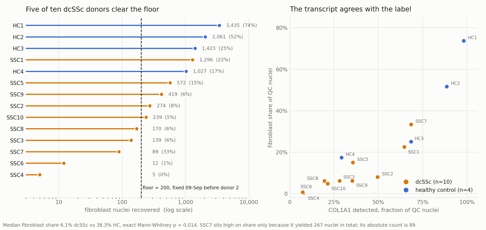

# ssc-skin-multiome-composition

Reprocessing of **GSE312129**, the single nuclei multiome arm of an early, treatment
naive diffuse cutaneous systemic sclerosis skin study (10 dcSSc, 4 healthy controls,
lesional forearm; JCI Insight, PMID 41411065).

**Headline result.** Fibroblast nuclei are recovered from SSc skin at roughly one sixth
the rate of healthy skin: median 6.1 percent of quality controlled nuclei against 38.3
percent, exact Mann-Whitney p = 0.014. The direction is opposite to the disease. That
asymmetry is a composition confound for any dcSSc versus healthy comparison built on
this dataset.

See `docs/composition_note.md`.



## What this repository is, and is not

It is the **complete record of an analysis that did not reach its preregistered
endpoint**, kept intact rather than trimmed to the part that worked.

The original aim was to determine which RUNX paralog accompanies the RUNX family motif
accessibility that the source study reports in SSc fibroblasts and attributes to RUNX1.
That analysis specified a floor of six donors with at least 200 fibroblast nuclei. Five
cleared it. **The preregistered analysis was not run and no RUNX result is reported,
here or anywhere else.** The composition finding came out of diagnosing why.

Everything that went wrong along the way is in `docs/`, including a bug in which the
RUNX1 motif was scanned and then silently discarded, and three logged deviations, one of
which records a withdrawal criterion firing against a change that was then kept on
different and explicitly stated grounds.

## Reproducing the composition result

The headline result needs only the deposited filtered matrices. No fragment files, no
reference genome, no motif database.

```bash
pip install -r requirements.txt
python src/label_audit.py          # downloads 14 h5 files, prints the table
python src/make_composition_fig.py # writes figures/composition_fig.png
```

`label_audit.py` expects a writable `WORK` directory; edit the constant at the top. Each
`filtered_feature_bc_matrix.h5` is fetched from its per GSM supplementary path, so no
tar extraction is needed.

## Repository layout

```
src/
  label_audit.py            the composition result; the only script needed for it
  make_composition_fig.py   the figure
  runx_paralog_pipeline.py  the full preregistered pipeline (did not reach its endpoint)
  (Colab driver lives in notebooks/run_pipeline_cell.ipy)
  gate_zero_v2.py           checks what is actually deposited under a GEO accession
  jaspar_inspect.py         matrix IDs and species for the motifs in play
  which_matched.py          prints WHICH filenames matched a hint, not that some did
  depth_confound_check.py   sequencing depth against detection, per gene
  donor1_*.py              single donor diagnostics run in sequence
notebooks/
  GSE312129_donor1_probe.ipynb   one donor, gated, before committing to fourteen
  run_pipeline_cell.ipy          Colab cell that drives runx_paralog_pipeline.py
                                 (contains IPython ! magics, not importable Python)
docs/
  composition_note.md            the writeup
  preregistration/               protocol and both preregistrations, v1 withdrawn
  deviations/                    every change to the plan, with its reason and date
  findings/                      the stop record, the bug, and two negative results
archive/
  superseded scripts kept for provenance
```

## Method summary

Per sample `filtered_feature_bc_matrix.h5` from the per GSM supplementary path. Gene
expression features separated from peak features. Nuclei with fewer than 500 detected
genes or more than 20 percent mitochondrial counts dropped.

Cell identity assigned **per nucleus, never per cluster**, by `scanpy.tl.score_genes`
over ten fixed marker panels with matched control gene sets, taking the highest scoring
panel and labeling a nucleus ambiguous when the top two scores differ by less than 0.05.
No UMAP inspected, no cluster chosen by eye. Panels, thresholds and rule fixed in writing
before any donor beyond the first was processed.

ACTA2 and TAGLN are deliberately **excluded** from the pericyte and smooth muscle panel,
because myofibroblasts express both and including them would move exactly the nuclei of
interest into the wrong category.

## Design notes worth stealing

Three habits in this code exist because their absence caused a specific failure here.

**Gates raise, they do not warn.** Every check that must stop the run calls `raise`.
A prior pipeline in this program printed a failed inspection and carried on for weeks.

**Human supplied values start as sentinels.** `'<<SET ME>>'` raises if untouched. A
prior pipeline shipped `TOP_CLUSTERS = ['2', '3']   # <-- REPLACE with actual cluster IDs`
into an executed run; the two clusters turned out to be simply the two largest.

**Print what matched, not that something matched.** Three separate silent failures in
this work were substring matches: a file hint list, a barred term check, and motif names
where case insensitive selection met case sensitive lookup. Every selector here logs its
matches by name and identifier.

## Data

GSE312129: https://www.ncbi.nlm.nih.gov/geo/query/acc.cgi?acc=GSE312129
GSE312932: the spatial arm of the same study, not used here.

No data files are redistributed in this repository. Everything is fetched from NCBI at
run time.

## Citation

See `CITATION.cff`.

## Authorship

Glen Charles Ritschel (Ritschel Research, ORCID 0009-0006-5341-8840) and Claude (Anthropic).

GCR conceived and directed the work, validated every claim in it, and made every decision
recorded in `docs/`. Claude drafted the code and the prose. Author order and creator format
match the house convention used across the Ritschel Research Zenodo deposits.

Errors are published rather than quietly fixed, which is why `docs/findings/` contains a bug
report and a stop record rather than only results.

## License

Code under MIT (`LICENSE`). Documents in `docs/` under CC BY 4.0.
